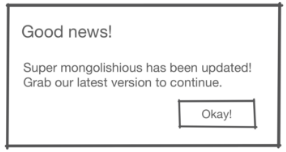
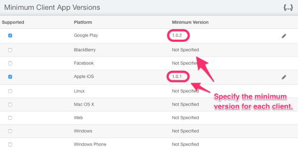

## Launch Tip #1: Version Enforcement

_This post is the first of our new series on best practices to observe before launching your app._

It's an exciting feeling... Features are complete. Beta feedback incorporated. Final bits of polish applied. **You are ready to launch.**

**Or are you?** Are you sure that you have... Tested for every usage scenario? Every race condition? On each of thousands of device variations? Under unpredictable network conditions? Accounted for changing performance characteristics as your user base ramps?

Luckily you are using **brainCloud** - so you know your servers will handle the loads. **But what about your client app?** Your dev team is prepared to react and fix issues quickly - **but how will you ensure that important updates make it to your users quickly?**

Sure - the app stores support automatic software updates - but even so, **it can take [3 weeks](https://www.quora.com/How-frequently-do-users-actually-update-their-iOS-apps) before the majority of your user base is using the new version of your app**. That's far too long if your app is crashing, corrupting data, and/or generally frustrating your users. **In those 3 weeks your app's ratings will take a huge hit.**

This is why it is essential to implement **Version Enforcement** _before_ you go live.

The good news is that brainCloud makes it easy.

 

* * *

 

# Version Enforcement

brainCloud has built-in support for enforcing minimum client versions.  During authentication, in addition to transmitting information about the user that is logging in, the brainCloud client library sends two key pieces of information:

- **platform** \- the type of device that the user is logging in from
- **gameVersion** \- the version of the client game or app

These parameters aren’t just informational - brainCloud’s _**Version Enforcement**_ feature allows you to ensure that only users of a _specified version and above_ can log into your application. This forces out-of-date users to upgrade their clients before proceeding.

Version Enforcement is configured via the brainCloud Portal, and works in collaboration with integration code that you add to your app.

 

* * *

_Above - the **Design | Core App Info | Platforms** screen_

_Note -  you can specify this minimum version on a per-platform basis, allowing you to accommodate staggered release schedules, different app approval processes, etc._

 

* * *

 

## Integrating Version Enforcement

Integrating Version Enforcement into your app is very simple.

Follow these steps:

1. **Set the _app version_ in your client app.** In most of the brainCloud client libraries, this is done via the [BrainCloudClient.Initialize()](/apidocs/api-modules/client/braincloudclient/#bc-snippets-Initialize) function. In Unity, you can use the **brainCloud Settings** dialog.In either case, the version should be a string of format of "X.X" or "X.X.X" - for example, "1.0.0".
2. Go to **Design | Core App Info | Platforms**, and temporarily set the minimum app version to something higher than your current app version.
3. Enhance the Authentication error handling of your app to catch the out-of-date error response (see the _Version Enhancement_ section of the [Authentication API](/apidocs/api-modules/authentication/braincloudauthentication/) page for details) - and display an appropriate message to the user. _Ideally you should redirect the user to your apps store page so that he/she can trigger the update immediately. The brainCloud portal allows you to datafill the upgrade URL along with the minimum version._
4. Test to ensure that it works!

That's it. Once this is in place, you will rest easier knowing that if (when) your users find problems in the field, that you'll be able to push fixes to them in no time!
