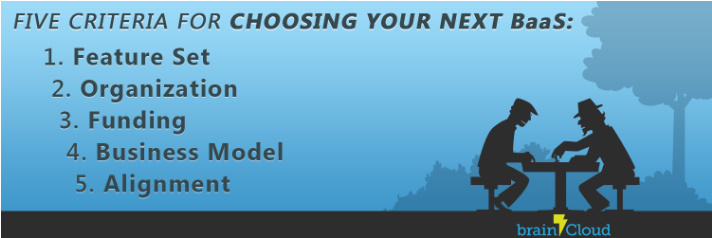
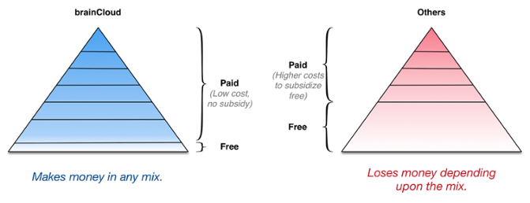

## Parse and who can you trust?

On Thursday, Facebook dropped a [bomb](http://bits.blogs.nytimes.com/2016/01/28/facebook-to-shut-down-parse-its-platform-for-mobile-developers/?_r=0). They announced that they were [shutting down Parse](http://blog.parse.com/announcements/moving-on/), the Mobile Backend-as-a-Service (MBaaS) platform that they acquired in 2013.

Parse is one of brainCloud's competitors, and arguably the biggest and most established player in the BaaS industry. Even so, brainCloud doesn't run up against them _that_ much because we have a richer, more specialized featureset that works better for our customer base.

In the wake of this event, it is inevitable that people are asking "What happened?" and "How can we trust any BaaS to build our business upon". To that end, I thought I'd put together a few thoughts.

## Why was Parse shut down?

The internet is a-buzz with comments that _the business must have been failing_.

I don't buy that. The business case for the Backend-as-a-Service market is very strong, and Parse had a good product for the space they were aimed at. By all accounts, they had plenty of customers and an overall strong business. So why close it?

The answer is that Parse no longer aligned with the goals of it's parent company, Facebook.

At the time that Parse was acquired, Facebook was floundering. They had recently IPO'd, but hadn't figured out their mobile and advertising strategy. The stock was down, revenues were down - and they made a series of acquisitions hoping to strengthen and diversify their portfolio. Parse, well positioned as a platform for enabling mobile apps, seemed like a smart play to help them build up their mobile presence. And I'd say it was.

But now, almost three years later, things have changed. Facebook has totally turned it's ship around. It is now a [juggernaught in mobile](http://marketingland.com/nielsen-top-apps-of-2015-dominated-by-facebook-google-apple-156694), has advertising sales through the roof, and is more focused than ever on building out its core product. In managing everything it is doing, Facebook needs to continually ask itself: "Is <x\> strategic to our overall success?"

And I think that's where Parse failed the test. Parse's business was probably $50-$100M per year. Healthy, for sure - heck, we'd take it! But that's just a drop in the bucket to Facebook (less than 1% of revenue!), which will net close to $20B this year. And yet, I'll bet that division had some of Facebook's best engineers!

And that's what it comes down to - Facebook said as much in their blog post. They are going to **["focus their resources elsewhere."](http://blog.parse.com/announcements/moving-on/)** I don't think this is the normal generic excuse that a company makes when they announce bad news - in this case, I believe that it is very _literally_ what they are doing.

 

## Who can you trust?

In the wake of the Parse shut-down, a lot of people will be wondering how they can put their trust in any Backend-as-a-Service. After all, a ton of people probably chose Parse specifically because it was run by Facebook - a huge, incredibly successful organization, that was guaranteed to be around for years to come.

Here is my suggestion on the evaluation criteria to consider:

1. _**Feature Set**_ - always start with the features - there is no point in going for a solution that doesn't meet your needs.
2. _**Organization**_ - consider the organization that develops it. Are they a long-standing, established business, that has earned a solid reputation in the marketplace?
3. _**Funding**_ - how is the company/product funded? **Beware of purely VC-funded companies.** A lot of BaaS vendors are early stage VC-funded - this makes for splashy million dollar announcements and marketing materials, but the funding comes with strings attached, in terms of _"You must succeed by <x\> or you will be shut down."_
4. _**Business Model**_ - does the business model make sense? Is it easy to understand how the business would make money for the organization? If not, be wary - a _"too good to be true"_business model is often a sign of a last-ditch "hail mary" throw for success.
5. _**Alignment**_ - Does the product align with the strategic goals of the parent organization. No matter how good the product, Facebook has just proven that you are in danger if a clear alignment isn't there.

Given this critera, how does brainCloud rate?

1. _**Feature Set**_ - we pride ourselves on our features, and the rapid pace at which they are evolving. With brainCloud (especially in comparison to a lower-level offering like Parse), you spend _less time building features and more time using them_. And we match each new feature with a visual tool for configuring and managing it.brainCloud goes over-and-above the classic BaaS capabilities with support for Gamification (xp, milestones, quests, achievements, leaderboards, etc.), Segmented Push Notifications, Scheduled Cloud Code, Auto Promotions, Mobile Multiplayer, Shared User Accounts, External Authentication, Server-to-Server APIs, a dynamic DataStream Architecture, and much much more.
2. _**Organization**_ - brainCloud is built by [bitHeads](http://www.bitheads.com/), a 20-year old technology software developer based in Ottawa, Canada, in conjunction with [playBrains](http://www.playbrains.com/), our game development subsidiary. bitHeads has earned a reputation as one of the top software development companies in Canada, and through the years has built award-winning products for Microsoft, Sony, Blackberry, Canada Post, Samsung, E\*Trade, Nortel, Mitel, and hundreds of others.
3. _**Funding**_ - brainCloud is privately funded by bitHeads, its parent organization, with some assistance from various Canadian government programs. We are privately controlled, and thus no ultimatums.We started building brainCloud over four years ago, well before the term BaaS or MBaaS was a thing. We saw the value and opportunity in this market back then, and are determined to build the best product for it.
4. _**Business Model**_ - we don't give brainCloud away, but we do work to keep the cost of the service as low as possible. brainCloud is free for development (maximum 100 dau), but you pay starting at $30 / month once you go live. _This minimal charge ensures that every brainCloud customer is pulling their weight and paying their share of the costs for the service._ This allows us to offer lower prices than our competitors, while at the same time ensuring that _bitHeads can operate brainCloud indefinitely._Contrast that with the models of some of our competitors, and ask yourselves how they can possibly be successful in the mid-to-long term? They have to charge their paid users more, and are basically betting that they will have enough high-volume customers to pay for the inevitably huge number of low-volume customers (that they subsidize for free). And some models are even crazier! _These are the sorts of bets that you make when you are desperate for your next round of VC funding, or looking to be bought_.
5. _**Alignment**_ - brainCloud arose because bitHeads was constantly building custom backend solutions for our customers. And we were building them over-and-over again, with largely the same features. For online casinos. Retail networks. Telecommunications. Mobile/Social games. For twenty years.Four years ago, we finally said, wait - what if we did this once, and productized it, so that we (nor anyone else) has to keep re-inventing the wheel? And thus brainCloud was born. It started as a small, separate team working within the company to build the core server system. We released the first apps on the platform almost three years ago - before we had a design portal with which to design and manage things (configuration was CSV and JSON back then).Today the team consists of twenty-ish people within the larger bitHeads/playBrains organization, together with the support teams to make that work. All services teams at bitHeads are aligned to delivering products and services around brainCloud. The custom apps and games that we build today are built upon brainCloud - it's our competitive advantage. And we continue to productize and evolve the platform based on the feedback of our great community of developers.There's no fear of alignment here - bitHeads _is_ brainCloud.

 

And there you have it - my take on Parse, and how bitHeads and brainCloud rate as a Backend-as-a-Server that you can trust. To our brainCloud customers today, thanks a bunch - rest assured, we are in this for the long haul.

And if this is your first exposure to brainCloud, please [sign up](https://portal.braincloudservers.com/signup#/) and take a look for free. If you take a good look at our features and tools, we think you'll realize the power of the system we've developed, and the passion of the folks building it.

Oh - and if you are looking to move from Parse, please [check out this survey](https://www.surveymonkey.com/r/W93BKYC). Filling it out will help us to prioritize the tools and support processes that we're developing to assist Parse migration.

Happy coding folks!

Paul.

_(PS - And for all you Parse-based folks looking to move, feel free to reach out. Our services teams would be happy to help you move over to our platform!)_
