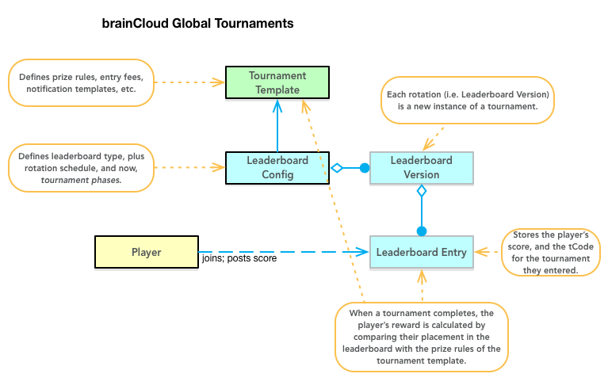
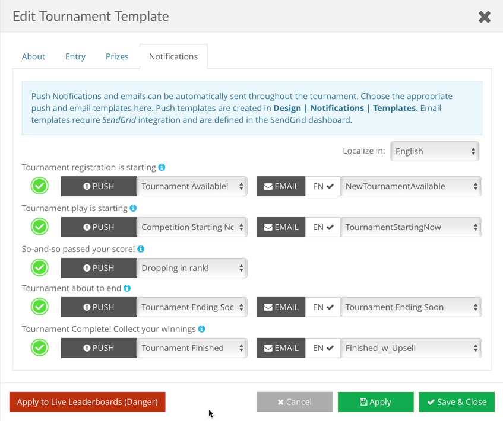

## Introduction

brainCloud's new **Global Tournaments** feature is an entirely new system designed to amplify player engagement in your games.

_Global Tournaments_ are suitable for any game where competition centres around _leaderboards_. In fact, in their simplest version, _Global Tournaments_ can be thought of simply as _prize rules_ associated with a _leaderboard_.

_But as you will see, there is actually a whole lot more to them._

 

## Goals

When designing **Global Tournaments**, we had a specific set of goals in mind.

brainCloud's Global Tournaments should:

- Be _easy_ to add to apps
- Be _flexible_ in terms of tournament schedule, phases, rules, payouts, etc.
- Integrate with brainCloud's existing _reward_ systems
- _Automate_ key aspects of player engagement
- Be _manageable_ so that entry fees, prize amounts, etc. can change over time as you iterate
- Act as building blocks for building more complex tournament types (i.e. tiered tournaments, etc.)
- Work within the existing brainCloud pricing tiers

 

## Features

**Global Tournaments** support the following key features:

- **Duration** - support for daily, weekly, and arbitrary length tournaments (up to 14 days)
- **Phases** - support for optional _announcement_, _enrollment_, _competition_, _buffer_ and _award_ phases
- **Flexible Prizes** - Award participants any combination of _virtual currency_, _xp_, _player stats_, _achievements_ and _custom data_
- **Entry fees** - Free vs. Paid Tournaments
- **Push Notifications** - automatically send configurable push notifications at key points during the tournament
- **Email Integration** - send custom email notifications as well

 

## Design

### Concepts

This diagram describes the main entities involved in creating a Tournament:

- Leaderboards are defined in the brainCloud system by entities we call _Leaderboard Configs_
- To create a tournament, you attach a _Tournament Template_ to a _Leaderboard Config_
- The _Tournament Template_ defines the rules of a tournament - entry fees, prize rules, notification templates, etc.
- The _Leaderboard Config_ defines how scoring works (highest score, cumulative score, etc), the rotation schedule, and also the _pacing of the tournament phases_.
- Each rotation of the leaderboard is a _Leaderboard Version_. All scores are stored by version in _Leaderboard Entry_ objects.

 

Special rules:

- The same _tournament template_ may be used by _multiple leaderboards_. This of course creates a separate tournament per leaderboard.
- A leaderboard may also attach _multiple tournament templates_. This is useful for cases where you want to have both free and paid versions of a tournament, that act upon the same set of scores. (_rationale: better liquidity, smaller payouts_)

 

### Tournament interactions / api

The following are the key tournament interactions to understand:

- _Get Tournament Status_ - returns the status of the specified tournament, and whether the player is currently enrolled in it. If the player is not enrolled, returns details of _all_ the tournament configs associated with the leaderboard
- _Join Tournament_ - all tournaments must be joined before you can submit scores to them. Joining a tournament involves specifying the leaderboard that anchors the tournament, and the `tCode` of the tournament \[template\] that you are joining. _An entry fee will automatically be deducted from the player's currency balance if required._
- _Post Tournament Score_ - posts an score to the tournament leaderboard. Note that you must pass in the epoch time that the game round started in, to ensure that the score is eligible. _Note that there are several versions of this operation (see the API for details)._
- _View Current Reward_ - returns the player's standing in the currently active tournament, and the reward they can expect to receive if they keep this rank.
- _View Reward_ - returns the players reward for a completed tournament, and whether it has already been claimed. Will return an error if the player is not enrolled in the tournament.
- [_Check For Events_](/apidocs/apiref/#capi-event-getevents) - query the brainCloud events queue to see if any Tournament Completion events have arrived
- _Claim Tournament Reward_ - claims the rewards for a completed tournament, incrementing appropriate player balances (currencies, etc.).

For more information on these interactions, see the [Tournament API](/apidocs/apiref/#capi-tournament).

 

### Phases and States

_Tournament States_ are used to organize the larger tournament lifecycle. They determine when tournaments are active, processing award calculations, and available for award clams.

_Tournament Phases_ help to micro-manage when players can join tournaments, post scores, etc. throughout the Active tournament state.

The following diagram summarizes the relationship between brainCloud tournament states and phases:

_Note that brainCloud doesn't explicitly tell you the phase it is in - instead, it gives you information as to when registration starts and ends, when play starts and ends, etc._

 

### Events and Notifications

A key goal of brainCloud's Global Tournaments system is to automate the tournaments interactions with players. As such, the system:

- Automatically rotates and cycles through tournament states and phases as per the schedule defined
- Send events to players when the tournament has completed
- Optionally sends push notifications and/or emails
    - When a new tournament opens for registration (enrollment) - sent to previous tournament participants
    - When a new tournament opens for play (competition) - sent to previous and currently registered participants
    - When a tournament's competition phase is close to ending - sent to current participants
    - When another player beats their tournament score, bumping them down a rank - sent to current participants within 10 ranks of the player who posted the score
    - When a tournament completes and they're awards are ready to be claimed - sent to current participants. The system also sends an Event to the player's event queue.

Note that you shouldn't blindly configure all notifications - especially the email-based notifications. Some recommendations:

- Obviously, do not configure both Tournament Registration start and Tournament Play start if your tournament doesn't have an exclusive registration period, or your players will get two back-to-back notifications, and be annoyed.
- Be careful about configuring Email-based notifications - we've included the trigger points, but for most cases we would recommend that you mostly use them to announce that a tournament is complete and that the player should come collect their prize. It's also a handy opportunity to include info on other game offers, bonuses items to increase scores, etc.
- Be aware that brainCloud does not yet support automated unsubscribes (coming soon)

 

#### Special: Scoring notifications

There are two types of designers. Designers who think that scoring notifications are cool, and those that think they could get annoying very quickly. And they are both right.

To add the engagement of scoring notifications, hopefully without overwhelming the player, we've added the following rules:

- We'll only send a player _one_ scoring notification per 24-hour period

The are two additional rules that affect this:

- If you post a new score, we reset the notification clock. This means that engaged players _will_ receive more than one notification in a 24 hour period, because they're actually responding to them.
- We won't send the player a score update until at least 30 minutes after their last posted score (i.e. you don't want to receive a push notification _immediately_ after exiting the game)

 

#### Bonus Features: Auto Join and Auto Reward

Global Tournaments offer an incredible way to increase engagement and monetization with your players - but what if you are just looking for a quick way to automatically add rewards to your weekly leaderboards - without code changes?

Look no further - brainCloud has two new features that allow you to automate the key portions of the tournament processing:

- _Auto Join_ - Enables players to automatically join the tournament associated with a leaderboard, simply by posting a score to it (via the standard leaderboard PostScore method). Note that this only works for leaderboards that have _one-and-only-one tournament_ associated with them - and that tournament must be _free_.
- _Auto Claim_ - Causes tournament rewards to be automatically claimed by players during login. Note that the _\[x\] Enable Tournament Auto Claim check at login_ compatibility flag must also be enabled on the Design | Core App Info | Advanced page of the portal

_Note - although we provide the Auto Join and Auto Claim features for convenience, in most cases we would definitely recommend that you implement the full tournament API. A key benefit to tournaments is engaging with your players - getting them excited about what they can win and adding that extra flourish as they claim their prizes. Auto Join and Auto Claim hide all that - minimizing the opportunity for extra player engagement._

 

## Features Availability and Billing Notes

Global Tournaments are available across all brainCloud subscription plans.

The basic API billing rules are in effect - 1 API count per API call, 1 API count per Push Notification, 1 API count per Email Sent

In addition, the following counts are added to offset the overheads of automated tournaments:

- _Awards Calculation_ - At the end of the tournament, 1 Bulk API Count _per participant_ is charged to cover the CPU load of processing results and sending events to the players
- [_PostTournamentScoreWithResults()_](/apidocs/apiref/#capi-tournament-posttournamentscorewithresults) - adds 1 Bulk API count to cover the overhead of comparing the players previous and current tournament results, and determining whether to send notifications to displaced players. As compensation, however, returns the updated tournament results (essentially [GetGlobalLeaderboardView()](/apidocs/apiref/#capi-leaderboard-getgloballeaderboardview)), hopefully saving the app an API call in return.
- Auto Claim - if the Auto-Claim feature is enabled, 0.5 Bulk API Counts are added to each Authentication()
