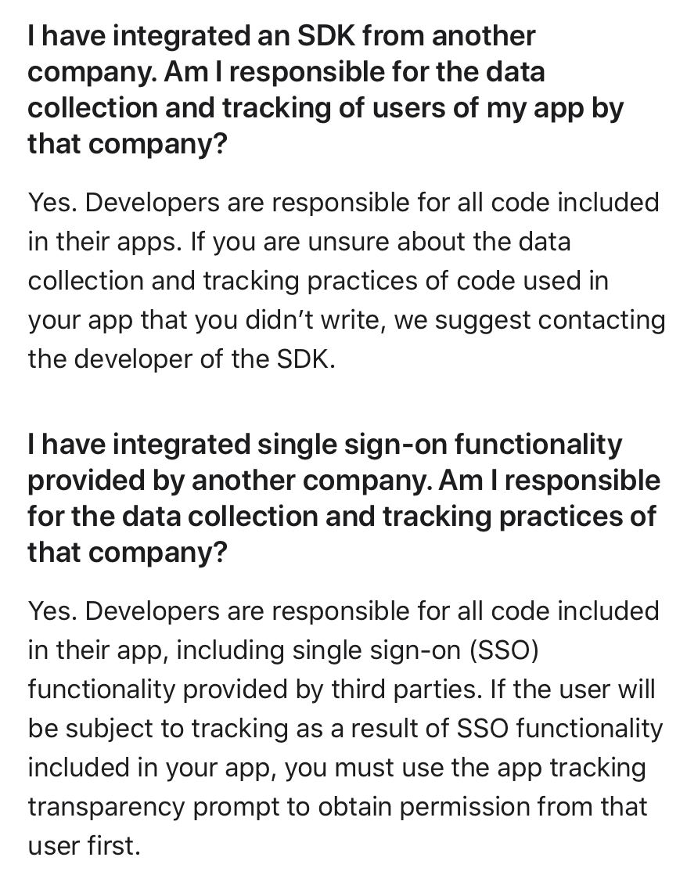
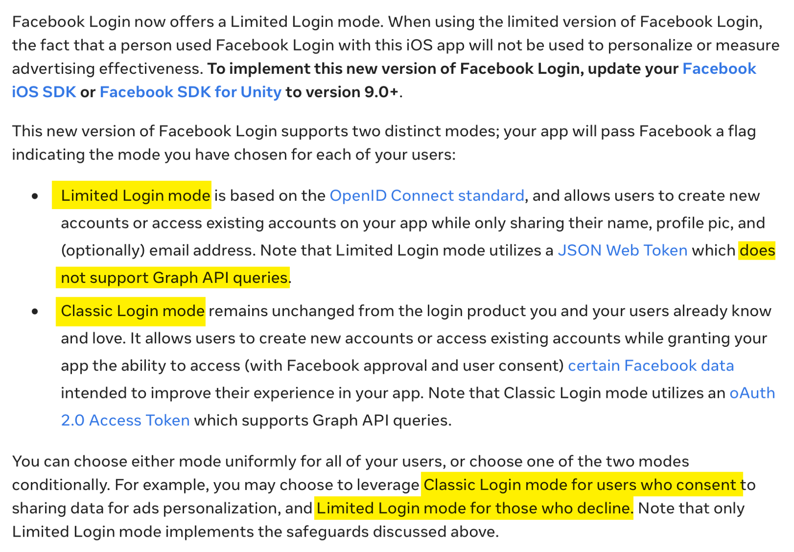

Apple is introducing comprehensive changes to iOS 14.5, iPadOS 14.5 and tvOS 14.5 that will require apps to ask users for their permission to track them across apps and websites owned by other companies.

At first glance, this seems like something that would mostly affect apps that are using user data for advertising-based monetization — but in truth, the implications are deeper than that.

For the record, we at brainCloud very much appreciate and advocate for user privacy. All user data associated with a brainCloud app is private to that app — the data is not aggregated or shared across apps or companies in any way. So if your app is using brainCloud without 3rd party authentication, you can feel confident that that data is not being shared in any way.

That said, brainCloud does support authentication-based integrations with third party providers — most importantly Facebook.

The Frequently Asked Questions from the Apple page linked above clarify their guidance in this area:

By this interpretation, just offering a classic Facebook Account login for your app — which is prety standard practice — requires you to get the user’s permission for tracking across apps and websites owned by other companies. The rationale is that your app may not be sharing the data — but Facebook itself certainly is.

Aside from Facebook’s objections to these changes (we don’t want to get into that) — Facebook has offered a recommended technical solution — they have extended their Facebook Login feature to include a new Limited Login Mode.

So — Limited Login mode seems like a pretty good solution to this problem. There is a pretty big limitation here though. If users opt for the Limited Login mode, the app will not have access to the Graph API.

For games and social apps — this is a pretty big limitation. It means that the app (and backend services like brainCloud that act on it’s behalf) will lose the ability to query Facebook for the user’s friends. This will have a huge impact on games that depend upon those sorts of social interactions for engagement and monetization.

It is therefore highly recommended that games pop-up their own informational message before Apple’s built-in pop-up, to educate the user on any features that may become unavailable as a consequence of their choice.

Another issue is that the identification information returned from the new Limited Login mode is different than with the Classic Login. This means that backend services, like brainCloud, need to implement changes to work with this new mode. The silver lining is that the underlying id of the user remains the same between the two modes — so a user who flips back and forth between the two modes can still be associated with the same back-end account — phew!

We at brainCloud are working hard to incorporate the necessary changes — and will be releasing brainCloud 4.7 with Facebook Limited Login mode before the end of March 2021.

A few more details about the changes in brainCloud 4.7:

- Full Support for Facebook Limited Login mode across the authentication + identity APIs. The same user using either mode will be linked to the same underlying brainCloud profile.
- brainCloud will automatically handle the loss of the Graph API for Limited Login mode users — so for example, users will simply appear to have no Facebook friends (instead of the client app having to deal with errors).
- Coincidentally, brainCloud 4.7 will include new support for Steam and Playstation Network friends — so apps can extend their friend support in other areas.
- brainCloud already supports self-managed Friend APIs. See AddFriends(), ListFriends(), etc.

We hope that this helps to clarify the impact of these changs to iOS 14.5, and how brainCloud can help your apps to adapt.
