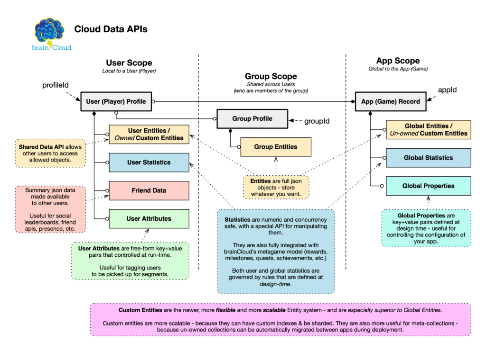

brainCloud provides a very flexible set of APIs for storing and retrieving the data for your app and its users.

These APIs are organized by scope:

- **User (Player) Scope** - the data stored and retrieved using these APIs are local to a single user\* of your application.
- **Global (App) Scope** - the data stored and retrieved using these APIs are accessible to all users of the application

\* Note, as a special case, the **Shared Data APIs** allow users to access the data of other users. Example uses are multiplayer in games, shared document or list access, etc.

Within each scope, the data APIs are organized according to the type of data to be managed.

- **Entities** - Entities (sometimes called _Deep Entities_) in brainCloud are full JSON objects - and can be as simple or complex as you'd like.  Entity objects have a unique id (generated by brainCloud), together with a developer-defined _entity type_ - which is useful for organizing the objects (and doing specific retrievals).  Entity objects are generally retrieved in bulk when an app starts and then updated in real-time while the user interacts with it. Entities updates can be protected using a version number mechanic - where updates are only allowed if the version # in the update matches the one in the cloud (which is then automatically incremented after the update). _Entities are created and edited at run-time only_.
- **Statistics** - Statistics are atomic numeric values that are manipulated via a special concurrency safe API.  Statistics rules must be _pre-defined at design-time_ in brainCloud - and are managed in real-time by brainCloud.  Statistics are not set directly - they are initialized to a starting value (defined in the rule), and then operated upon by special increment, decrement, etc. methods.  In this way, statistics are concurrency-safe both at the user and global level. Another key feature of Statistics is that they are tightly integrated into the metagame (Gamification) systems of brainCloud.  Statistics can be used to trigger the completion of milestones and quests.  They can also be rewarded for leveling up and completing milestones and quests.  They can be used as criteria for defining Segments for promotions.  Finally, they are very visible in the User (Player) Monitoring screens.
- **Attributes** - Attributes are somewhat similar to statistics, but the "value" portion of the key + value pair does not have to be numeric.  In addition, attributes do not have rules - your app is free to create and assign attributes to users in any variety at any time.  Note that brainCloud currently only supports attributes at the user level.

Finally, there are two additional data APIs available to the developer:

- **Friend Data (User Scope)** - Friend data is used primarily to publish information about the current user (to be viewable by other users).  This is most commonly used for social leaderboards, where key information about the player (name, xp level, etc.) provides a better context for competition.  The structure of this data is completely under the control of the app.
- **Global Properties (App Scope)** - Global properties are set at design-time (using the portal), and available to all users of the app.  These are a convenient (and dynamic) replacement for global constants or a properties file.  They are generally read when the app first starts - making it easy to tweak the behavior of your app in the field (without deploying an updated build).

Related Information:

- **Custom Entities** - API accessed via [CustomEntity](/apidocs/apiref/#capi-customentity). Custom Entity collections can be defined in the Portal under **Design | Cloud Data | Custom Entities** and viewed and edited in **Global Monitoring** and **User Monitoring** sections.
- **User Entities** - API accessed via [BrainCloudEntity](/apidocs/apiref/#capi-entity). User Entities can be viewed and edited in the Portal under **User (Player) Monitoring** section.
- **Global Entities** - API accessed via [BrainCloudGlobalEntity](/apidocs/apiref/#capi-globalentity). Global Entities can be viewed and edited in the Portal in the **Global Monitoring** section.
- **Shared Data API** - API accessed via [BrainCloudEntity](/apidocs/apiref/#capi-entity) -- set GetSharedEntitiesForPlayerId().
- **User (Player) Statistics** - API accessed via [BrainCloudPlayerStatistics](/apidocs/apiref/#capi-playerstats).  Statistics rules are defined in the Portal in the **Design | Statistics Rules** section.
- **Global Statistics** - API accessed via [BrainCloudGlobalStatistics](/apidocs/apiref/#capi-globalstats).  Statistics rules are defined in the Portal in the **Design | Statistics Rules** section.
- **User Attributes** - API accessed via [BrainCloudPlayerState](/apidocs/apiref/#capi-playerstate).  User attributes can be viewed and edited in the **User (Player) Monitoring | Attributes** section of the Portal.
- **Friend Data** - API accessed via [BrainCloudFriend](/apidocs/apiref/#capi-friend).  Not currently viewable via the player monitor.
- **Global Properties** - API accessed via [BrainCloudGlobalApp](/apidocs/apiref/#capi-globalapp).  Global properties can be viewed and edited in the **Design | Custom Config | Global Properties** section of the Portal.
- **Groups** - API accessed via [BrainCloudGroup](/apidocs/apiref/#capi-group) and [BrainCloudGroupEntities](/apidocs/apiref/#capi-group). Data can be viewed and edited in the **Monitoring | Group Monitoring** sections of the Portal.
