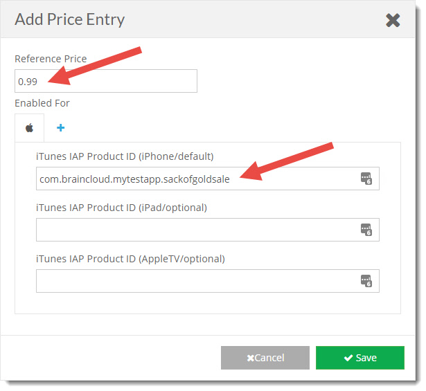

brainCloud allows the developer to create and customize their marketplace. By defining a set of products, you can administer which products are available, for which users, and for what price. brainCloud also allows you to integrate with third-party store systems such as iTunes, Google Play, Facebook, Steam, Microsoft Store (Phone and Desktop/Tablet).

Below is a quick guide to configuring the brainCloud marketplace.

### Create a Virtual Currency

In order to create a product in the marketplace, you need to have a virtual currency to award the player. Let's start by creating a virtual currency.

- Navigate to the "Marketplace | Virtual Currencies" page in the design tab of the brainCloud portal  
    
- Click the + icon in the top right corner  
    
- Enter a name for your virtual currency (it can be anything you want) and click Save  
    
- You should now see your virtual currency listed in the table  
    

### Create a Product

Now that you have a virtual currency defined, it's time to create a product so that users can purchase that virtual currency! To create a marketplace product do the following:

- Navigate to the "Marketplace | Products" page in the design tab of the brainCloud portal  
    
- Click the "Add Product" button in the top right  
    
- In the Create Product dialog enter the following information:
    - **Item Id** - This is a unique id for your product. You will use this id within the brainCloud APIs to identify your product.
    -  **Title** - The title of your product
    - **Category** - An optional field that allows you to categorize your products. When communicating with brainCloud you can ask for only a certain category of product (for cases where you have many products defined)
    - **Description** \- Description of your product
    - **Product Type** - Configures what type of product you are defining. This is mostly related to the third party store that you are linking to the product.
        - **Consumable** - A one-time consumable product. Once purchased, this product will be consumed once and only once. Most products fall into this product type
        - **Non-consumable** - A product which can never be consumed. Buying an item in your game that can never be used up (say a special sword) might be an example of a non-consumable.
        - **Subscription** - A subscription to something in your app. Again this is mostly determined by the third party store item configuration as subscriptions generally incur some sort of regular charge to the end user.
    - **Currency Type** - The type of virtual currency to award
    - **Currency Value** - The amount of virtual currency to award
    - **Prices** - A list of prices for the item. We will configure this in the next section so you can leave it blank for now.
    - **Extra Data** - Any custom key/value data pairs you'd like to attach to the product.
- Click Save

### Add Prices to Your Product

After having created a product, you'll want to attach some prices to it so that users can see and purchase it. Products by default are created with a "Not for sale" price which means they won't show up in any of the brainCloud API requests for products. Let's add a price so we can see our product.

#### Add a default price

- If you just created the product, you should already see the "Add Price" button for your product. If not, select a product in the marketplace product table and make sure the product is in "Edit" mode.  
    
- Click the Add Price button  
    
- Enter a default price which will be used to calculate internal brainCloud analytics such as daily/total revenue. Note this is NOT the actual price charged to the user. That information is defined elsewhere depending on the third party store being integrated. At this time you can also enter your third-party store information. If you're unsure of what to enter here please refer to the "Third Party Store Integration" tutorials in the portal section for your appropriate third-party store.  
    
- Click Save.
- Next, we can select our newly created price as the default. Note you may have to hit the "Edit" button at the top of the product dialog.  
    
- Click Save and that's it!
- For the more curious amongst you, you can also verify that your product is coming back in the Product "GetInventory" API call using the Cloud Code API Explorer  
    

#### Add an "on sale" price

The marketplace allows for multiple prices to be attached to a product. This allows you to put certain items on sale - say for instance a 50% sale. In fact, because multiple prices can be entered, your product could have a 25% and 75% off sale too!

In order to add another price to your product, you can basically follow the steps above and then enter a different reference price and third party store id.
