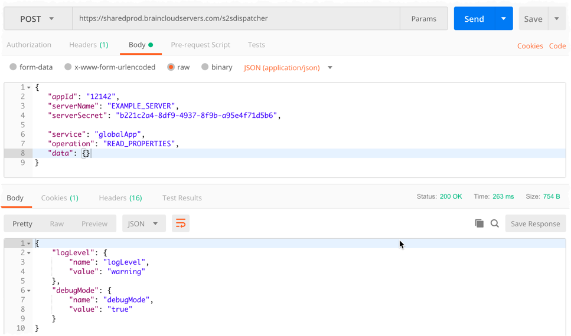
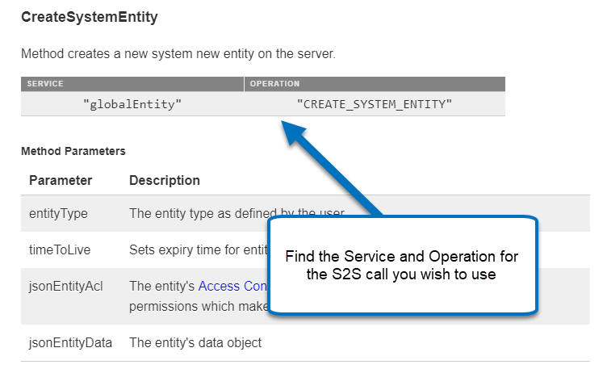

brainCloud support two varieties of S2S calls: with and without explicitly-allocated sessions.

- _session-less_
    - simpler, but less efficient
    - a disposable `sessionId` is automatically generated on the server (via authentication), and disposed of after the call
    - this takes time and costs an additional API count
- _session-based_
    - faster _and_ less expensive!
    - supports request bundling
    - to use, you must first authenticate (similar to the Client API) to retrieve a sessionId, and then use that sessionId in future calls while incrementing the packetId associated with the message

_Note - the session-based S2S protocol, like the client protocol, supports the bundling of several API calls within a single HTTP request. In most circumstances it is more practical to combine the calls into a single cloud code script instead._ 

Overall, the session-based S2S protocol is recommended for production applications, because it eliminates the redundant creation of disposable sessions. It performs better and costs you less! This tutorial will show you how to simulate both types of requests via Postman.

* * *

## Installing PostMan

To install Postman, simply:

- Download from [https://www.getpostman.com/](https://www.getpostman.com/)
- Choose your platform, and complete the installation process

* * *

## Pre-requisite: Configuring S2S Servers

Incoming servers must be configured (i.e. declared) in the brainCloud dashboard before making S2S calls. This allows brainCloud to confirm that the requests are coming from a server that you own and aren't malicious.

- Launch the [brainCloud Portal](https://portal.braincloudservers.com)
- Navigate to the **Design | Cloud Code | My Servers** page. Click  the **\[+New Server\]** button
- Give your server a name, like "EXAMPLE\_SERVER"
- Entering IP ranges restricts access to requests coming from the specified network addresses. This is highly recommended for production apps! For now, you can leave the ranges blank. This will make all IP ranges acceptable.
- Hit **\[Save\]**, and note your _server secret_ - you will use it later.

* * *

## Session-less S2S Requests

Session-less requests are simple. Each request is completely independent - no `sessionIds` or `packetIds` to manage. This API is best when calls into brainCloud are few and far between.

_To simulate a session-less server request with Postman:_

- Launch Postman
- Add a new Request
- Set the request type to **POST**
- Set the request URL to: "[https://sharedprod.braincloudservers.com/s2sdispatcher](https://sharedprod.braincloudservers.com/s2sdispatcher)"
- In the **Body** section of the request, choose **raw** and set the type to **_JSON (application/json)_**
- Copy this JSON into the body, setting the `appId`, `serverName` and `serverSecret` appropriately for your app

{  
   "appId":"12142",
   "serverName":"EXAMPLE\_SERVER",
   "serverSecret":"b221c2a4-8df9-4937-8f9b-a95e4f71d5b6",
   "service":"globalApp",
   "operation":"READ\_PROPERTIES",
   "data":{  

   }
}

- Select **\[Send\]**
- View the Response

Unless you have added some properties, you will see an empty JSON response.

To change this, go to the **Design | Custom Config | Global Properties** page of the brainCloud Portal and configure a property or two - then run this request again. Voila!

* * *

## Session-based S2S Requests

Session-based requests require you to first request a `sessionId` to use via the Authenticate operation. You then reference that `sessionId` in subsequent requests, along with an incrementing `packetId`.

_First, we need to Authenticate to get a SessionId_

- From Postman, Add a new Request
- Set the request type to **POST**
- Use the same request URL: "[https://sharedprod.braincloudservers.com/s2sdispatcher](https://sharedprod.braincloudservers.com/s2sdispatcher)"
- In the **Body** tab of the request, choose **raw** and set the type to  **_JSON (application/json)_**
- Copy this JSON into the body, setting the `appId`, `serverName` and `serverSecret` appropriately for your app
- **(in both places!)**
- View the response, and save the `sessionId` that is returned.
- Now, make a second request, using that `sessionId` and setting the `packetId` to `1`
- For each subsequent request, be sure to increment the `packetId`. Try this one:

{  
   "packetId":0,
   "messages":\[
       {
         "appId":"12142",
         "service":"authenticationV2",
         "operation":"AUTHENTICATE",
         "data": {  
            "appId":"12142",
            "serverName":"EXAMPLE\_SERVER",
            "serverSecret":"b221c2a4-8df9-4937-8f9b-a95e4f71d5b6"
          }
       }
   \]
}

- View the response, and save the sessionId that is returned.
- Now, make a second request, using that sessionId and setting the packedId to 1

{
   "sessionId":"df5gelac0mhrpht31ffgtgatoe",
   "packetId":1,
   "messages":\[
      {
         "service":"globalEntity",
         "operation":"CREATE\_SYSTEM\_ENTITY",
         "data":{
            "entityType":"address",
            "timeToLive":null,
            "acl":{
               "other":1
            },
            "data":{
               "street":"1309 Carling"
            }
         }
      }
   \]
}

- For each subsequent request, be sure to increment the `packetId`. Try this one:

{  
   "sessionId":"df5gelac0mhrpht31ffgtgatoe",
   "packetId":2,
   "messages":\[  
      {  
         "service":"globalEntity",
         "operation":"GET\_LIST",
         "data":{  
            "where":{  
               "entityType":"address"
            },
            "orderBy":{  

            },
            "maxReturn":50
         }
      }
   \]
}

So, you get the idea.

Important things to remember:

- _Always_ increment the `packetId` - _except for identical retries_. If you're retrying the same request because of a communications failure, you should keep the `packetId` the same (it helps the server to prevent duplicate operations from happening). If you got a response from the server though, successful or not, you should increment the packetId for you next request.

* * *

## Service and Operation Codes

The API calls documented in the API Ref ([https://staging.getbraincloud.com/apidocs/apiref/?raw#s2s](https://staging.getbraincloud.com/apidocs/apiref/?raw#s2s)) are mapped to discrete _Services_ and _Operations_ on the server.

The codes, together with operation-specific parameters (specified in the JSON `data` object) are used to send commands to the server.

Only the API Calls in the S2S section of the API Ref can be used for S2S calls.
