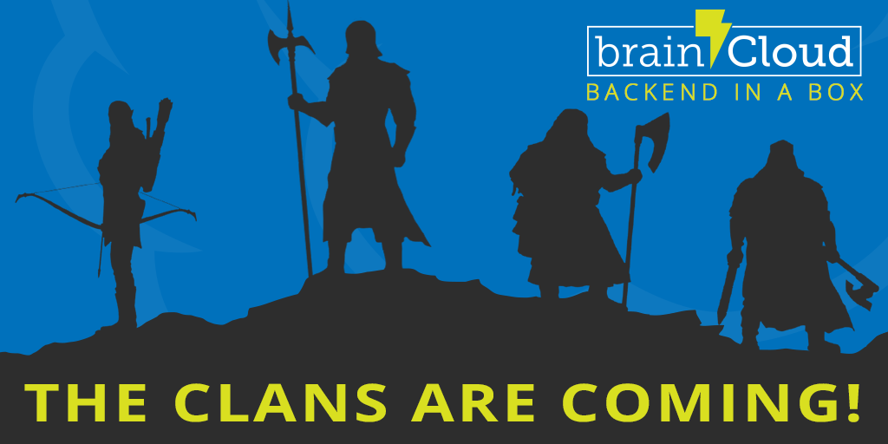
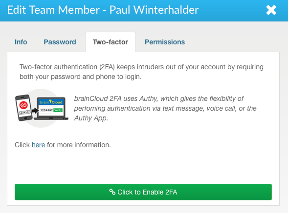

## Release Highlights

This release delivers six new features:

- **Groups! (i.e. Clans!)** - allow your users to clan-up for greater socialization and competition!
- **2FA for Teams!** An extra level of security for your development accounts.
- **Scheduled Push Notifications!** Deliver that message at exactly the right time no matter what timezone your users are in.
- **Universal Windows Support** - we have a new C++ library for [Universal Windows Platform (UWP)](https://msdn.microsoft.com/en-us/windows/uwp/get-started/universal-application-platform-guide) apps.
- **Xamarin Support** - we have new iOS and Android libraries for Xamarin!
- **watchOS Support** - built native apps on watchOS using brainCloud!

Plus the usual assortment of API and library improvements. Note that all client libraries have been updated to the latest, except Javascript, which will be updated and released mid-next-week (week of Friday May 18th).

Read on for all the details.

* * *

## Release Highlights

### Groups (i.e. Clans)

Although you've always been able to write your own clan system in brainCloud using Global Entities and Cloud Code, we thought it was about time that we lent a hand - reducing the coding burden, and adding great tools support at the same time.

This feature provides an API that allows users to dynamically create, join and manage Groups.

Groups have the following characteristics:

- Groups are a combination of a _collection of users_, plus some _shared data_ about those users
- Groups in brainCloud are organized by Group Type. The developer defines a Group Type, setting certain rules such as maximum # of members, and the action to take if a Group's owner is deleted.
- There are three built-in roles - _owner_, _admin_ and _member_
    - Groups are _owned_ by a single user - but can have additional _admins_
    - Only the owner of a group may delete it. Owners may leave a group only if they re-assign ownership to another user.
    - Group membership can be _open_ or _closed_. Open groups can be freely joined by anyone. Closed groups require an owner or admin to _invite_ or _approve_ join requests.
    - Groups can associate additional attribute data with members - which can allow for additional developer-defined role types (i.e. think ranks in Clash of Clans - Leader, Co-Leader, Elder, Member, etc)
    - A user can be a member of more than one Group. (Limits can be imposed by the developer, of course).
- Group data is a JSON object associated with the group. Access to the data is controlled by the group ACL.
- Groups can also own a set of entities (i.e. Group Entities) for more complex data needs. Group Entities can be owned by the group as a whole, or by individual members within a group.
- Group membership can be used for leaderboard retrieval

For more information re: brainCloud group support, refer to the [Group API Reference Page](/apidocs/apiref/?objective_c#capi-group) .

 

### Two-factor Authentication (for Team Members)

brainCloud's Two-Factor Authentication (2FA) support allows you to tie your phone to your developer account for extra security and peace-of-mind.

We've chosen to use Twilio's [Authy](https://www.authy.com/app/mobile/) technology for our 2FA implementation - it works similarly to Google Authenticator, but gives more options in terms of authentication (text, voice, or app) and offers better management of verification devices.

Hooking up 2FA to your account couldn't be simpler:

- Choose **Edit Profile** from the top-right **Power** menu of the brainCloud Portal
- Go to the new **Two-factor** tab
- Click on the green **\[Click to Enable 2FA\]** button and follow the prompts!

For more information, refer to the [Enabling 2FA](/apidocs/portal-usage/two-factor-authentication-for-team-members/) page in our documentation.

 

### Scheduled Push Notifications

Through the magic of scheduled cloud code and our push notification API, it's always been possible to schedule push notifications to happen at a precise time. But - what if you want to send notifications to a segment of users, and ensure that those notifications get sent at a standardized local time - say 9am, for each of the users, regardless of their timezone? That was much, much harder.

Until now. Our new Schedule Push Notification interface allows you to specify a local time to send all notifications at. brainCloud will then automatically create the appropriate set of scheduled push notification jobs - one for each timezone involved - and then automatically send the notifications at the appropriate time for each group of users.

It's extremely powerful, and very simple to use. Check out the new S2S API calls [here](/apidocs/apiref/?cloudcode#s2s-push).

 

### Universal Windows Platform Support

We've created a new C++ library with support for [Universal Windows Platform](https://msdn.microsoft.com/en-us/windows/uwp/get-started/universal-application-platform-guide) apps. And we're making the library available via nuget as well. Stay tuned for more details.

 

### Xamarin Support

With it's recent [acquisition by Microsoft](http://blogs.microsoft.com/blog/2016/02/24/microsoft-to-acquire-xamarin-and-empower-more-developers-to-build-apps-on-any-device/#sm.0000emdu1ai1yfgwrwg1uyf2dwt9j), and integration into Visual Studio, we're finding tons of interest in [Xamarin](https://www.xamarin.com/platform) support for brainCloud. We're pleased to announce the availability of the brainCloud Xamarin.ios and Xamarin.android libraries!

 

### watchOS Support

Apple has announced that moving forward, [all new and updated watchOS apps must be native](https://developer.apple.com/news/?id=04222016a). We are here to help, so we've built a new version of the brainCloud library that runs natively on watchOS 2. You're welcome!

* * *

 

## Portal Changes

The first thing you will notice is that we have re-ordered the tabs of the Design section of the portal to be mostly alphabetical (we still kept the Core App Info section at the top). We've added (and continued to add) so many features to brainCloud, going alphabetical seems like the only way to keep things easily findable.

In addition, we've made the following portal changes:

- **Power | Edit User**
    - Moved the **Password** section to a separate tab for clarity.
    - Added a new **Two-Factor** tab for enabling Two-Factor Authentication (2FA).
- **Admin | Team Members**
    - Added a _2FA_ column so that you can confirm which team members have enabled Two-Factor Authentication for additional security.
- **Design | Cloud Code | Scripts**
    - The scripts screen is now sortable according to the date+time that the scripts were last updated.
- **Design | Groups**
    - The new **Group Types** screen to allow you to define that types of groups that your application will support. Configuration information includes the maximum # of users allowed per group (default is 50 - contact us if you need higher), and what the system should do if the owner of a group is deleted.
- **Monitoring | Global Monitoring | Jobs**
    - Added support for viewing _Scheduled Push Notification_ jobs.
- **Monitoring | Group Monitoring**
    - Added new **Group Monitoring** section to allow you to view and manage an application's global user groups
    - The **Groups** screen presents a list of all groups, filterable by type of group. You can view the details of a Group by clicking on it - you can even edit the Group's json-data.
    - The **Group Entities** screen displays a list of entities associated with groups. The list is filterable by entity type and/or group id. _Pro-tip - to clickly see a group's entities, look up the group in Group Monitoring first, and then choose "View Group Entities" from the action menu._
- **Monitoring | User Monitoring | Groups**
    - Shows the groups that a user is a member of, together with details about the group and the user's membership.

* * *

 

## API Changes

The following additions / changes have been made to the brainCloud API:

- **Global Entities**
    - New [IncrementGlobalEntityData()](/apidocs/apiref/?csharp#capi-globalentity-incrementglobalentitydata) method allows you to increment discrete numeric values in a global entity. Great for incrementing atomic stats-like values without pushing a full update to the entire JSON object.
- **New Group API**
    - There are too many new API methods to list here. For the full description of the new Group and Group Entity APIs, see the [Groups](/apidocs/apiref/?csharp#capi-group) section of the API Reference documentation.
- **Leaderboard API**
    - New [GetGroupSocialLeaderboard()](/apidocs/apiref/?csharp#capi-leaderboard-getgroupsocialleaderboard) method retrieves a leaderboard filtered to the members of the specified group
- **Push Notifications**
    - New [SendNormalizedPushNotificationToGroup()](/apidocs/apiref/#capi-push-sendnormalizedpushnotificationtogroup) and [SendTemplatedPushNotificationToGroup()](/apidocs/apiref/#capi-push-sendtemplatedpushnotificationtogroup) methods sends push notifications to the members of a group
    - New S2S Scheduled Push Notifiation methods ( [ScheduleNormalizedPushNotifications()](/apidocs/apiref/#s2s-push-schedulenormalizedpushnotifications) and [ScheduleRichPushNotifications()](/apidocs/apiref/#s2s-push-schedulerichpushnotifications) ) allow you to send push notifications to users according to their timezone
- **User Entities**
    - New [IncrementUserEntityData()](/apidocs/apiref/?csharp#capi-entity-incrementuserentitydata) method allows you to increment discrete numeric values in a user entity. Just as useful as the GlobalEntity, Group and GroupEntity versions of the same method!
    - New [GetSharedEntitiesListForPlayerId()](/apidocs/apiref/#capi-entity-getsharedentitieslistforplayerid) method retrieves a list of shared entities for the specified player based on the specified where clause

 

* * *

 

## Miscellaneous Changes / Fixes

- New/updated libraries
    - New Universal Windows Platform (UWP) C++ libs
    - New iOS and Android Xamarin libs
    - New watchOS libs
    - Upgraded version of OpenSSL in C++ libs
- Fixes and changes
    - Pre-hook cloud-code methods can no longer directly call the API that invoked them (prevents recursion loops!)
- Documentation Updates
    - Migrated reason codes over to new API Ref docs
    - Improved performance of new API Ref docs -- Table-of-Contents now cached
    - API doc links in API explorer moved to new API Ref
    - Tutorials upgraded to link to new API Reference
    - New error handling tutorial
- Miscellaneous defect fixes
- Miscellaneous performance improvements
