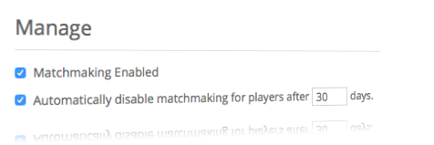
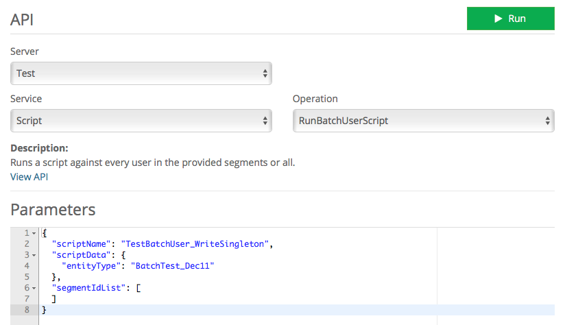

We are pleased to present release 3.6.5 - just in time for the holidays!

_Note that there are some breaking changes in the client libraries - but they are pretty simple to accomodate, and of course will not affect your app until you update. For more details, see the **Refactored Client Libraries** section below._

* * *

## Feature Highlights

### Fresher Matchmaking

We have added a new expiry feature to keep your matchmaking fresh. It is implemented via a nightly process that will disable the matchmaking flag for users that haven't logged into the app within the specified number of days.

 

Enabling this feature will ensure that players don't get matched with opponents who haven't recently logged into your game.

Important notes:

- The nightly process only runs for **Live** apps. This feature does not affect apps still in development. (This saves server cycles, plus while in development it is tough to get enough players to match against already!)
- Auto-Expiry is turned **OFF** by default for _existing_ apps.
- Auto-Expiry is turned **ON** by default for _new_ apps (with expiry set to 30 days).
- _Important: brainCloud will not automatically re-enable matchmaking for a disabled user once they login_. Apps using this feature should directly call `EnableMatchmaking()` whenever a user launches the app.

### Batch Scripts

A common customer request has been a way to iterate through the population of an app's users, performing some operations on each user's account. It has taken some time to find a proper way to do this that is scalable and safe - but we are pleased to announce that the first evolution of this is now in place.

We have introduced a new S2S Script Service method called `RunBatchUserScript()`. This script can be called via the S2S Explorer or from an external server - and queues the specified script to be run against each of the users in a app (or optionally, against particular segments). Although the `RunBatchUserScript()` is triggered from the S2S context, each individual script is run in the context of the current player - so it is as if the script was called by that user's logged-in session - greatly simplifying the script code.

Here's an example script that writes a global entity (singleton) for each player it is run upon:

var result;

\_globalEntityService = bridge.getGlobalEntityServiceProxy();

var acl = { "other": 1 };
var customData = { "test": "info" };

result = \_globalEntityService.createEntity(data.entityType, null, acl, customData );

result;

You can call it via the S2S Explorer like this:

Note that the scripts get queued to run on the users in the background - and depending upon the app's population may take several minutes or potentially several hours to complete.

### Refactored Client Libraries

The brainCloud client libraries have been refactored for greater simplicity and flexibility. Key improvements with these changes are:

- Support for multiple connections per device ← useful for devices that require multiple concurrent user logins - couch co-op, anyone?
- Saved wrapper data is now differentiated with a wrapperName value ← necessary to support multiple connections
- Access to all client services from the wrapper ← means the wrapper becomes largely invisible
- Simpler client code ← yay!

#### Key API changes

The key change that allows this is the _deprecation of the singleton behaviour of the brainCloud client libraries_. As you may or may not know, for convenience the brainCloud client libraries declared singletons for both the BrainCloudWrapper and BrainCloudClient library classes. This provided a bit of convenience for developers - but at considerable costs to flexibility (and frankly, some code readability issues). We are hereby deprecating this behaviour.

In addition, we are making the _client services callable directly from the wrapper_ - which greatly simplifies calling them (and abstracts whether you are calling via the wrapper or directly from the client).

For comparison - here are what two calls to the leaderboard API look like - before and after this API change:

// Old: Call leaderboard API via the wrapper singleton, to the leaderboard service via the BrainCloudClient object
BrainCloudWrapper.GetBC().getLeaderboardService.ListAllLeaderboards( ApiSuccess, ApiError);

// New: Same call. Note that whether \_bc is an instance of BrainCloudWrapper or BrainCloudClient, this code looks the same. Simpler, eh?
\_bc.LeaderboardService.ListAllLeaderboards( ApiSuccess, ApiError );

 

These improvements mean that some client code has to change - but the changes are pretty simple, and we believe well worth-it (see below).

Existing apps have the following options available to them:

- _No changes_ - stay with brainCloud libraries earlier than 3.6.5
- _Minimal changes_ - move to brainCloud library 3.6.5, but turn the legacy singleton mode on
- _Full changes_ - move to brainCloud library 3.6.5, initialize the brainCloud wrapper to your own global(s), and adjust your calling code accordingly

We highly recommend that new apps use the new paradigm - your code will be simpler for it.

For more information, see our [blog post](/apidocs/wrappers-clients-and-inconvenient-singletons/) with the full details and rationale.

* * *

## Portal Changes

We've made the following portal changes for this release:

### Team

- Navigation
    - We have restructured the **Team** navigation menu to better group the features. In particular, all of the Admin-management features are now located under the **Manage** menu.

### Design

- Core App Info | Advanced Settings
    - _**Disable**_ _**Live Lock**_ - Live Lock helps to protect your live apps by forcing you to unlock them before editing. You can now disable this behaviour if you would like (_Note - not recommended for production apps!_)
- Integrations | Sendgrid
    - Fixed an issue where test emails were no longer being sent when the **\[Test\]** button was pressed.
- Multiplayer | Matchmaking
    - **_Expire matchmaking_** - Automatically expire (disable) a user's eligibility for matchmaking after <x\> days without logging in. Helps to ensure that your players are matched with fresh opponents, instead of players who may no longer be active in your app!

### Monitoring

- User Monitoring | Logs
    - New **Export** feature exports requests and responses in their entirety... (before was limited to request and response summaries)

### **General**

- User Settings
    - _Language_ and _Timezone_ settings are now stored to the developers account profile (instead of local web storage). Also addressed an issue with daylight savings time.
- Entity Editors
    - _Global Entity Editor_, _Group Entity Editor_ and _User Entity Editor_ have all been updated to handle `Long` values better.

* * *

## API Changes

The following changes/additions have affected the brainCloud API:

- **Client**
    - `EnableSingletonMode` setting - if you wish to use the brainCloud singleton mode, it is still available, but it must be explicitely enabled. You can do so by setting `BrainCloudClient.EnableSingletonMode = true` in your app.
- **Multiplayer**
    - <**New!**\> `IncrementShield()` - allows you to increment the shield setting without reading it first. Especially useful when extending a shield that is already in place.
- **Script Service**
    - <**New!**\> `RunBatchUserScript()` - allows you to queue a script to be run against all of your apps's users! (or select segments)
- **Wrapper**
    - Singleton behaviour is now deprecated, but can be re-enabled using the `EnableSingletonMode` setting of the Client.
    - All of the brainCloudClient service accessors (except AuthenticationService) have been added to the wrapper.
    - Unity: Removed static class method `Client()` (which returned the client singleton) and replaced it an instance-level `Client()` get / set accessor (which returns the client object associated with this wrapper instance).

* * *

## Miscellaneous Changes / Fixes

- Updated libraries
    - All libraries have been updated with the refactoring and latest API enhancements. We recommend that all apps upgrade!
- Documentation updates
    - We have updated the docs to reflect the new client calling conventions
- Miscellaneous updates
    - We have updated brainCloud to use **version 2.7 of the Facebook Graph API**
- Important Fixes
    - BCLD-2756 - Losing verification code on merging Email account into another account
    - BCLD-2746 - PostTournamentScore/WithResults should auto-join player if Auto Join enabled for leaderboard config
    - BCLD-2742 - Rank added to postTournamentScoreWithResults
    - BCLD-2739 - Fix to before and after handling of postTournamentScoreWithResults
    - BCLD-2721 - When attaching an Email identity and app email feature Send Verification Email is checked , we aren't updating player emailAddress when should be
    - BCLD-2710 - PostTournamentScore(WithResults) - Null pointer exception when posting score to a leaderboard with tournament configured but not active until Next Cycle
    - BCLD-2699 - GlobalEntity Raw Export fails to import when <timeToLive\> is 0 (Integer vs. Long)
    - BCLD-2696 - Portal - If you switch apps while editing a web service the page does not update
    - BCLD-2662 - Non Admin Users see the Remove option in the actions menu of the Members page
    - BCLD-2607 - Disable the \[Go Live\] button once the user clicks it
    - BCLD-2597 - Portal - If data field for an Entity contains an integer that is too high show a proper error dialog
    - BCLD-2594 - Segment country-code not standardized as UPPERCASE
    - BCLD-2593 - BigInteger web defect - GlobalEntity, ChildEntity, Group and GroupEntity editors
    - BCLD-2646 - Fix the banner in Safari
- Plus miscellaneous fixes and performance enhancements...
